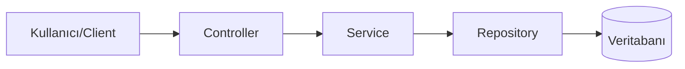
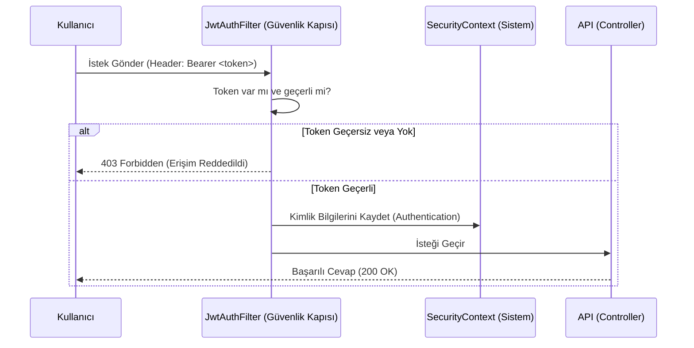

# Proje Mimari ve Kod Analizi (PROJECT_EXPLANATION.md)

Bu döküman, projenin arka planında çalışan mantığı, güvenlik akışını, hata yönetimini ve modüller arası iletişimi detaylı bir şekilde anlatmak için hazırlanmıştır.

## 1. Genel Bakış ve Katmanlı Mimari (Layers)

Proje, kurumsal uygulamalarda standart olan **Katmanlı Mimari** (Layered Architecture) yapısına sahiptir. Bir istek (Request) geldiğinde sırasıyla şu katmanlardan geçer:



1.  **Controller (Sunum Katmanı):** Dış dünyadan gelen HTTP isteklerini (GET, POST, vb.) karşılar. Parametreleri alır ve Service katmanına iletir.
2.  **Service (İş Katmanı):** Projenin beynidir. İş kuralları (Business Logic) burada çalışır. (Örn: "Kullanıcı zaten kayıtlı mı?", "Stok var mı?").
3.  **Repository (Veri Erişim Katmanı):** Veritabanı ile konuşan tek katmandır. SQL sorguları yerine JPA metodları ile veriyi çeker veya kaydeder.
4.  **Database (Veri Katmanı):** PostgreSQL veritabanımız.

---

## 2. Güvenlik Mimarisi (Security & JWT)

Güvenlik katmanı, uygulamamızı koruyan bir **filtre (Filter)** mekanizmasıdır. Bir istek Controller'a ulaşmadan önce _Security Filter Chain_ (Güvenlik Zinciri) dediğimiz bir kontrol noktasından geçer.

### İstek Kontrol Akışı (Security Flow)

Aşağıdaki şema, bir kullanıcının korumalı bir sayfaya erişmek istediğinde neler olduğunu gösterir:



### Önemli Bileşenler

- **`SecurityConfig`**: Kimin nereye girebileceğini belirleyen anayasa.
  - `/auth/**` (Login/Register) -> Herkese açık (PermitAll).
  - `/actuator/**` ve `/swagger-ui/**` -> Dokümantasyon ve izleme için açık.
  - **Diğer her yer** -> Sadece giriş yapmış (Authenticated) kullanıcılara açık.
- **`JwtAuthenticationFilter`**: Her gelen isteği durduran polis memuru. "Kimliğin (Token) var mı?" diye sorar. Varsa doğrular ve içeri alır.

---

## 3. Dinamik Hata Yönetimi (Exception Handling)

Uygulama içerisinde bir sorun olduğunda (örn: "Kullanıcı bulunamadı"), Java'nın karmaşık hata mesajlarını (Stack Trace) kullanıcıya göstermek yerine, **anlaşılabilir ve yapılandırılmış** JSON cevapları döneriz.

Bunu sağlayan sınıf: **`GlobalExceptionHandler`**

Bu sınıf tüm uygulamayı dinler ve bir hata fırlatıldığında araya girer.

**Örnek Senaryo:** Kullanıcı geçersiz bir e-posta ile kayıt olmaya çalışıyor.
**Cevap:**

```json
{
  "status": "ERROR",
  "message": "Doğrulama hatası",
  "errorDetails": {
    "code": "VALIDATION_ERROR",
    "details": "Girilen bilgiler geçersiz",
    "fieldErrors": {
      "email": ["Geçerli bir e-posta adresi giriniz"]
    }
  }
}
```

---

## 4. Kod Bileşenleri ve Görevleri (Component Deep Dive)

Profesyonel bir backend projesinde "ne, neden kullanılır?" sorusunun cevabı:

### 🛠 DTO (Data Transfer Object)

Veritabanı varlıklarımızı (Entity) doğrudan dış dünyaya açmak güvenlik riski oluşturur. Bu yüzden **DTO** kullanırız.

- **Ne Yapar:** Sadece Client'ın ihtiyacı olan veriyi taşır.
- **Örnek:** `RegisterRequest` (Kullanıcıdan sadece gerekli bilgileri alır), `LoginResponse` (Sadece token döner).

### 🔄 Mapper (Dönüştürücü)

Entity ve DTO arasındaki dönüşümü sağlar.

- **Ne Yapar:** `User` entity'sini `UserResponse` DTO'suna çevirir.
- **Neden:** Kod tekrarını önler ve Service katmanındaki "set" işlemlerini azaltır.

### 🧠 Service (İş Mantığı)

Uygulamanın zekası buradadır.

- **Örnek:** `AuthService`.
- **Görevi:** "Kayıt ol" isteği geldiğinde şifreyi hash'ler, kullanıcıyı veritabanına kaydeder ve token üretip döner. Controller asla bu detayları bilmez.

### 🎮 Controller (Trafik Polisi)

Gelen istekleri karşılar ve ilgili servise yönlendirir.

- **Örnek:** `AuthController`.
- **Görevi:** `@Valid` notasyonu ile gelen verinin doğruluğunu (email formatı, şifre uzunluğu) kontrol eder ve `AuthService`'i çağırır.

### 🛡 Exception Handling (Hata Yönetimi)

Kodun herhangi bir yerinde hata fırlatıldığında (örn: `throw new BusinessException("Stok yok")`), bu hatayı yakalayıp kullanıcıya anlamlı bir JSON döner.

---

## 5. Özet

Bu proje, sadece kod yazmak için değil, **sürdürülebilir, güvenli ve genişletilebilir** bir altyapı kurmak amacıyla tasarlanmıştır.

1.  **Modülerlik:** Her modül (Auth, User) birbirinden bağımsızdır.
2.  **Güvenlik:** JWT ile stateless (sunucuyu yormayan) güvenlik sağlanmıştır.
3.  **Kalite:** Hata yönetimi ve Validasyonlar ile veri bütünlüğü korunur.
4.  **İzlenebilirlik:** Swagger ve Actuator ile sistemin röntgeni çekilebilir.
