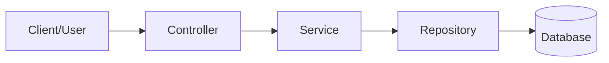
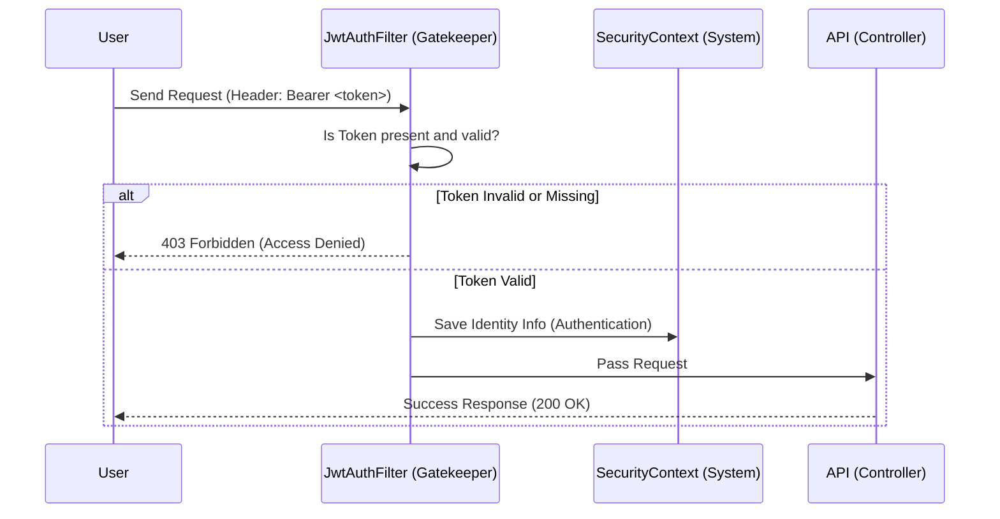

# Project Architecture & Code Analysis (PROJECT_EXPLANATION_ENG.md)

This document is designed to explain the logic running in the background, security flow, exception handling, and inter-module communication in detail.

## 1. Overview and Layered Architecture

The project follows the **Layered Architecture** pattern, which is standard in enterprise applications. A request passes through the following layers respectively:



1.  **Controller (Presentation Layer):** Handles incoming HTTP requests (GET, POST, etc.) from the outside world. Receives parameters and forwards them to the Service layer.
2.  **Service (Business Layer):** The brain of the project. Business rules run here (e.g., "Is the user already registered?", "Is there stock?").
3.  **Repository (Data Access Layer):** The only layer that talks to the database. It retrieves or saves data using JPA methods instead of raw SQL queries.
4.  **Database (Data Layer):** Our PostgreSQL database.

---

## 2. Security Architecture (Security & JWT)

The security layer is a **filter** mechanism that protects our application. Before a request reaches the Controller, it passes through a control point called the _Security Filter Chain_.

### Request Control Flow (Security Flow)

The diagram below shows what happens when a user wants to access a protected page:



### Key Components

- **`SecurityConfig`**: The constitution determining who can enter where.
  - `/auth/**` (Login/Register) -> Open to everyone (PermitAll).
  - `/actuator/**` and `/swagger-ui/**` -> Open for documentation and monitoring.
  - **Everything else** -> Open only to authenticated users.
- **`JwtAuthenticationFilter`**: The police officer stopping every incoming request. It asks, "Do you have an ID (Token)?". If yes, it verifies and lets you in.

---

## 3. Dynamic Exception Handling

When a problem occurs in the application (e.g., "User not found"), instead of showing complex Java error messages (Stack Trace) to the user, we return **understandable and structured** JSON responses.

The class providing this is: **`GlobalExceptionHandler`**

This class listens to the entire application and intervenes when an exception is thrown.

**Example Scenario:** User tries to register with an invalid email.
**Response:**

```json
{
  "status": "ERROR",
  "message": "Validation error",
  "errorDetails": {
    "code": "VALIDATION_ERROR",
    "details": "Invalid input data",
    "fieldErrors": {
      "email": ["Please enter a valid email address"]
    }
  }
}
```

---

## 4. Code Components & Roles (Component Deep Dive)

The answer to "what is used where and why" in a professional backend project:

### 🛠 DTO (Data Transfer Object)

Exposing database entities directly to the outside world creates security risks. Therefore, we use **DTOs**.

- **Role:** Carries only the data needed by the Client.
- **Example:** `RegisterRequest` (Receives only necessary inputs), `LoginResponse` (Returns only the token).

### 🔄 Mapper

Handles the conversion between Entity and DTO.

- **Role:** Converts `User` entity to `UserResponse` DTO.
- **Why:** Prevents code duplication and reduces manual "setter" operations in the Service layer.

### 🧠 Service (Business Logic)

The intelligence of the application resides here.

- **Example:** `AuthService`.
- **Role:** When a "Register" request comes in, it hashes the password, saves the user to the database, and creates a token. The Controller never knows these details.

### 🎮 Controller (Traffic Police)

Receives incoming requests and directs them to the relevant service.

- **Example:** `AuthController`.
- **Role:** Uses `@Valid` annotation to check data integrity (email format, password length) and calls `AuthService`.

### 🛡 Exception Handling

When an error is thrown anywhere in the code (e.g., `throw new BusinessException("No stock")`), it captures this error and returns a meaningful JSON to the user.

---

## 5. Summary

This project is designed not just to write code, but to establish a **maintainable, secure, and extensible** infrastructure.

1.  **Modularity:** Each module (Auth, User) is independent of each other.
2.  **Security:** Stateless security is provided with JWT.
3.  **Quality:** Data integrity is protected with Exception Handling and Validations.
4.  **Observability:** The system can be X-rayed with Swagger and Actuator.
